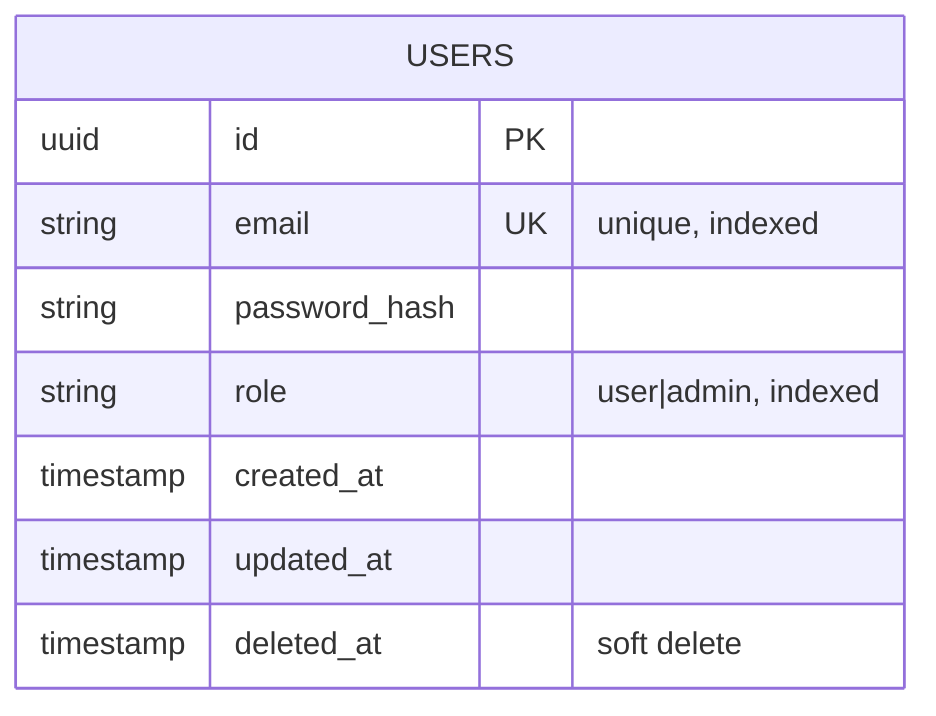

# ERD Diagrams - Product Review & Rating System

## User Service Database Schema



## Product Service Database Schema

```mermaid
erDiagram
    CATEGORIES {
        uuid id PK
        string name
        text description
        timestamp created_at
        timestamp updated_at
    }

    PRODUCTS {
        uuid id PK
        string name "indexed for search"
        text description
        decimal price
        uuid category_id FK
        decimal average_rating "computed, indexed"
        int total_ratings "count"
        timestamp created_at
        timestamp updated_at
        timestamp deleted_at "soft delete"
    }

    RATINGS {
        uuid id PK
        uuid product_id FK
        uuid user_id "from User Service"
        int rating "1-5"
        text comment "optional"
        timestamp created_at
        timestamp updated_at
        timestamp deleted_at "soft delete"
    }

    PRODUCT_RELATED {
        uuid product_id FK
        uuid related_id FK
        string relation_type "accessory|bundle|etc"
        timestamp created_at
    }

    CATEGORIES ||--o{ PRODUCTS : "has"
    PRODUCTS ||--o{ RATINGS : "has"
    PRODUCTS ||--o{ PRODUCT_RELATED : "relates to"
    PRODUCTS ||--o{ PRODUCT_RELATED : "related from"
}
```

## Indexes

### User Service

-   `idx_users_email` on `users(email)`
-   `idx_users_role` on `users(role)`

### Product Service

-   `idx_products_category_id` on `products(category_id)`
-   `idx_products_average_rating` on `products(average_rating)`
-   `idx_products_name` on `products(name)` (for Vietnamese search)
-   `idx_ratings_product_id` on `ratings(product_id)`
-   `idx_ratings_user_id` on `ratings(user_id)`
-   `UNIQUE idx_ratings_user_product` on `ratings(user_id, product_id)` where `deleted_at IS NULL`
-   `idx_product_related_product_id` on `product_related(product_id)`
-   `idx_product_related_related_id` on `product_related(related_id)`

## Relationships

1. **Categories → Products**: One-to-Many

    - One category can have many products
    - Product belongs to one category

2. **Products → Ratings**: One-to-Many

    - One product can have many ratings
    - Rating belongs to one product
    - Unique constraint: One user can rate one product only once

3. **Products → ProductRelated**: Many-to-Many (self-referential)
    - Products can relate to other products
    - Relation types: accessory, bundle, etc.

## Database Functions/Triggers

### Average Rating Calculation

```sql
-- Function to update average_rating and total_ratings
CREATE OR REPLACE FUNCTION update_product_rating_stats()
RETURNS TRIGGER AS $$
BEGIN
    UPDATE products
    SET
        average_rating = (
            SELECT COALESCE(AVG(rating), 0)
            FROM ratings
            WHERE product_id = COALESCE(NEW.product_id, OLD.product_id)
            AND deleted_at IS NULL
        ),
        total_ratings = (
            SELECT COUNT(*)
            FROM ratings
            WHERE product_id = COALESCE(NEW.product_id, OLD.product_id)
            AND deleted_at IS NULL
        )
    WHERE id = COALESCE(NEW.product_id, OLD.product_id);

    RETURN COALESCE(NEW, OLD);
END;
$$ LANGUAGE plpgsql;

-- Trigger on ratings insert/update/delete
CREATE TRIGGER trigger_update_product_rating_stats
AFTER INSERT OR UPDATE OR DELETE ON ratings
FOR EACH ROW
EXECUTE FUNCTION update_product_rating_stats();
```
