# Sequence Diagrams - Product Review & Rating System

## 1. User Registration Flow

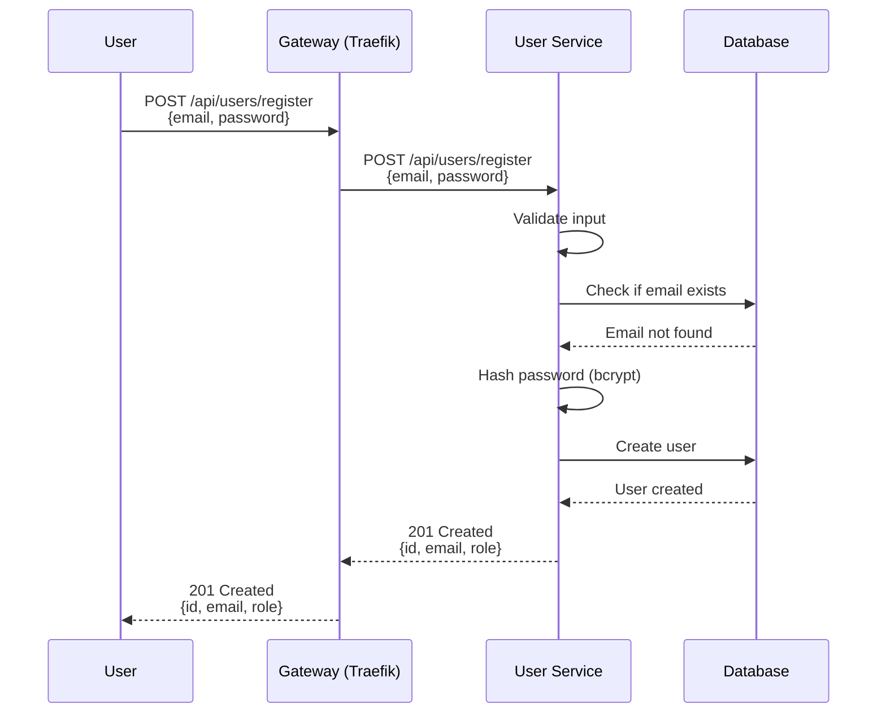

## 2. User Login Flow

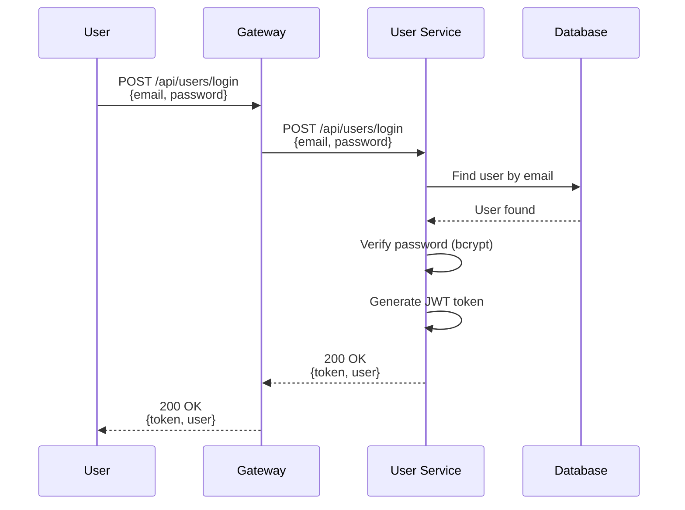

## 3. Token Validation Flow (gRPC)

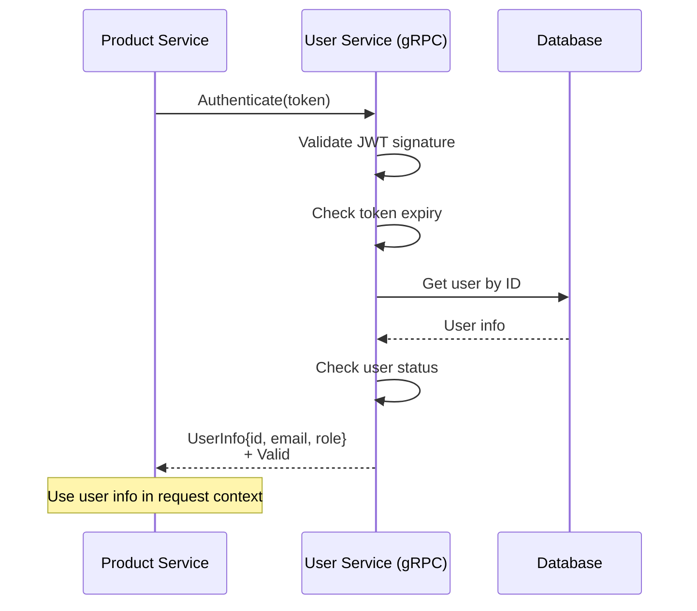

## 4. Get Products (Authenticated)

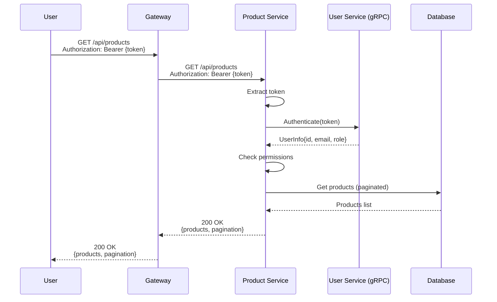

## 5. Search Products Flow

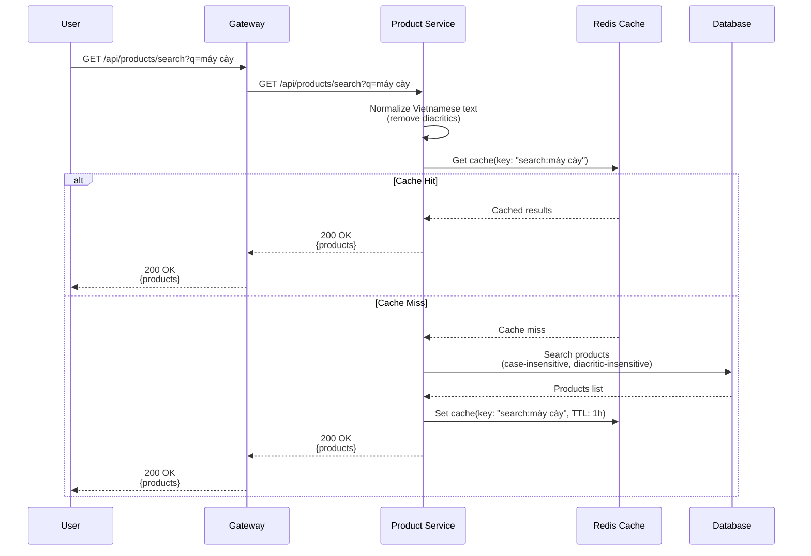

## 6. Create Rating Flow

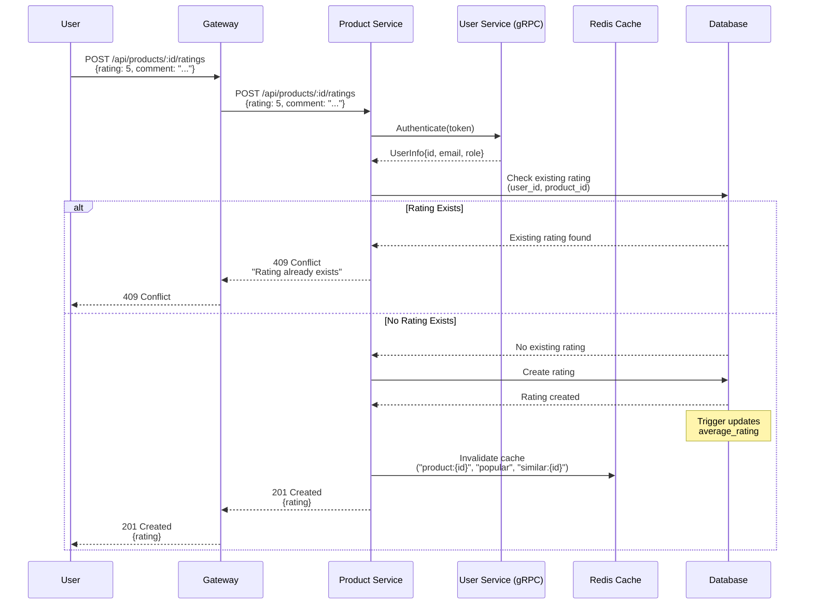

## 7. Update Rating Flow

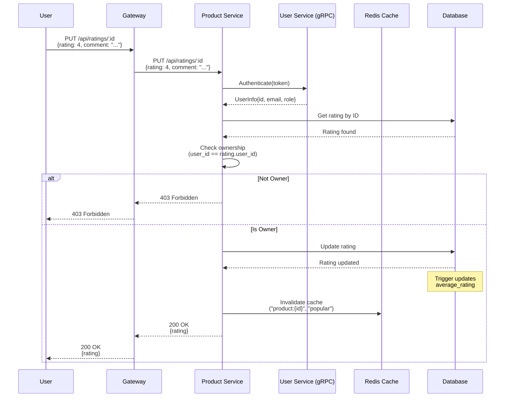

## 8. Get Similar Products Flow (Cached)

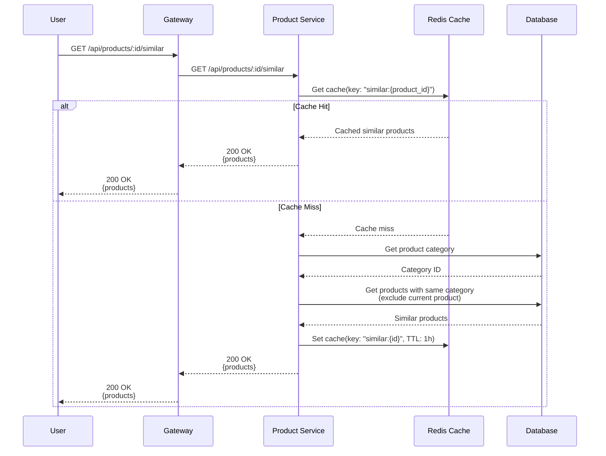

## 9. Get Popular Products Flow (Cached)

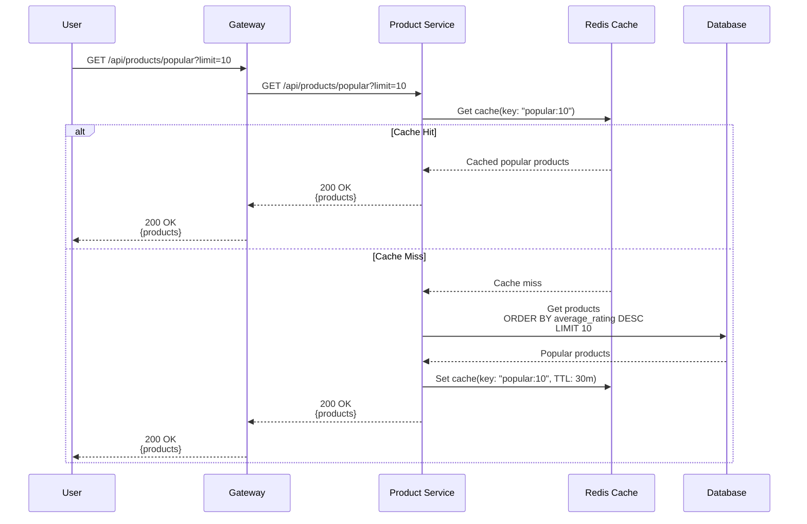

## 10. Admin - List All Users Flow

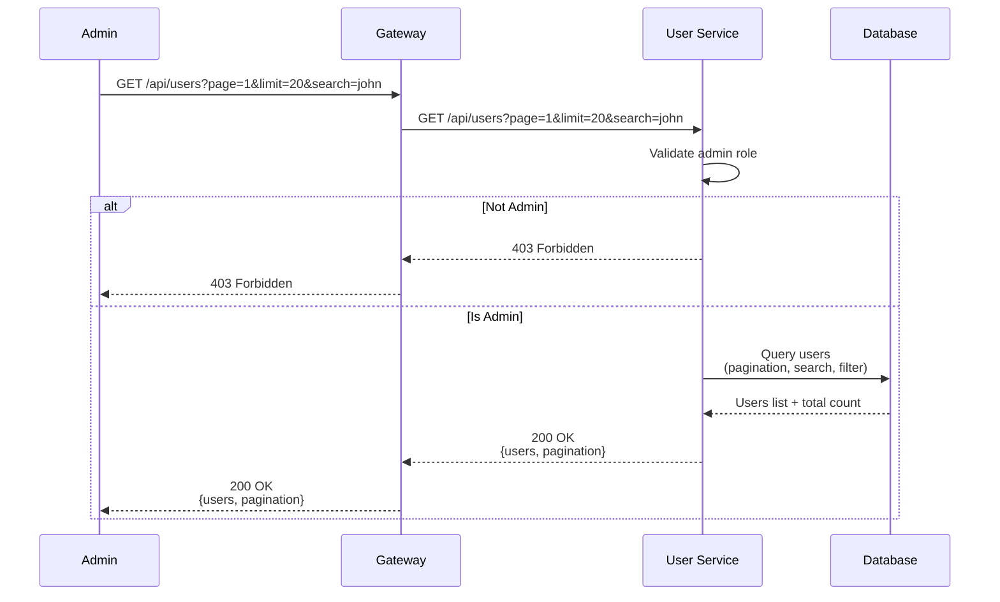

## 11. Admin - Update User Role Flow

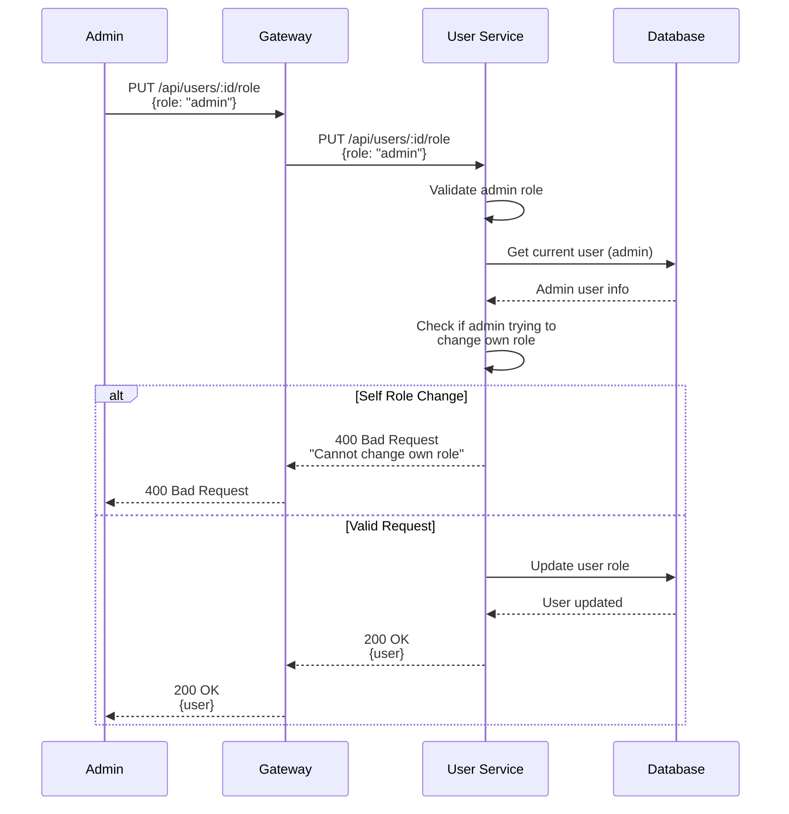

## 12. Delete Rating Flow

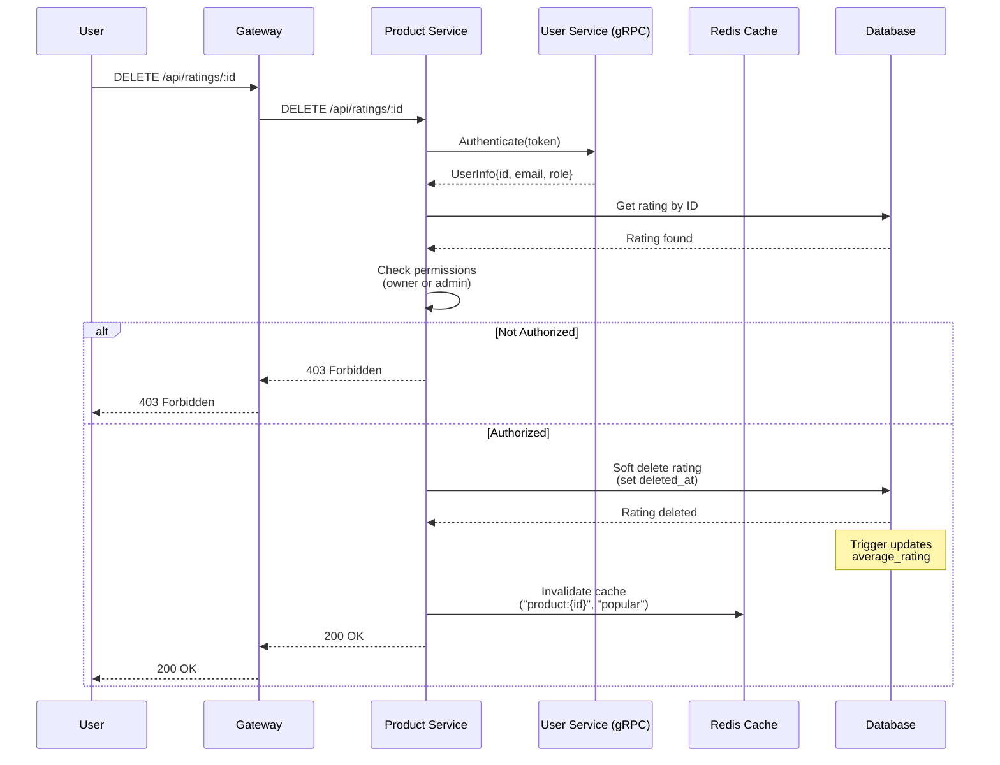
